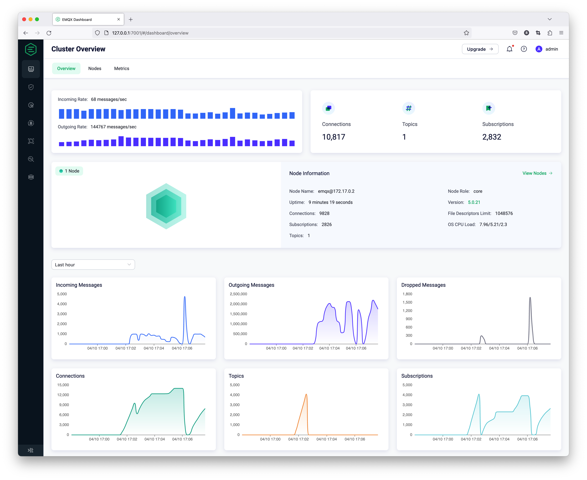

# The New Dashboard for EMQX 5.0

EMQX provides a built-in management console, the EMQX Dashboard. It allows users to easily manage and monitor EMQX clusters and configure and use the required features from a web page.



## Main features

- Data monitoring and management: important data clear at a glance
- Visually manage access control: out-of-the-box authentication and authorization management
- Powerful data integration capabilities: Flow editor and bi-directional data bridge
- Online configuration update: hot updates that save your configuration immediately
- Customizable extension capabilities: built-in gateways, plugins and Hooks
- More comprehensive diagnostic tools: identify and resolve problems in time

## Running

Install the latest version of [EMQX](https://www.emqx.com/en/try?product=broker) first.

After installing EMQX successfully, you can access and use EMQX Dashboard by opening <http://localhost:18083/> (replace localhost with the actual IP address if deployed on a non-local machine) through your browser. EMQX Dashboard is a web application that listens to port 18083 by default.

> EMQX can still be used normally without Dashboard enabled, Dashboard just provides the option for users to use it visually.

## Get Involved

- Follow [@EMQTech on Twitter](https://twitter.com/EMQTech).
- If you have a specific question, check out our [discussion forums](https://github.com/emqx/emqx/discussions).
- For general discussions, join us on the [official Discord](https://discord.gg/xYGf3fQnES) team.
- Keep updated on [EMQX YouTube](https://www.youtube.com/channel/UC5FjR77ErAxvZENEWzQaO5Q) by subscribing.

## Resources

- [MQTT client programming](https://www.emqx.com/en/blog/tag/mqtt-client-programming)

  A series of blogs to help developers get started quickly with MQTT in PHP, Node.js, Python, Golang, and other programming languages.

- [MQTT SDKs](https://www.emqx.com/en/mqtt-client-sdk)

  We have selected popular MQTT client SDKs in various programming languages and provided code examples to help you quickly understand the use of MQTT clients.

- [MQTT X](https://mqttx.app/)

  An elegant cross-platform MQTT 5.0 client tool that provides desktop, command line, and web to help you develop and debug MQTT services and applications faster.

- [Internet of Vehicles](https://www.emqx.com/en/blog/category/internet-of-vehicles)

  Build a reliable, efficient, and industry-specific IoV platform based on EMQ's practical experience, from theoretical knowledge such as protocol selection to practical operations like platform architecture design.

## Develop

```shell
# Project setup
yarn

# Compiles and hot-reloads for development localhost
yarn serve

# Compiles and minifies for production
yarn build

# Lints and fixes files
yarn lint
```

### Customize configuration

See [Configuration Reference](https://cli.vuejs.org/config/).

The CI will then run automatically, and it will be released after the run is complete.
