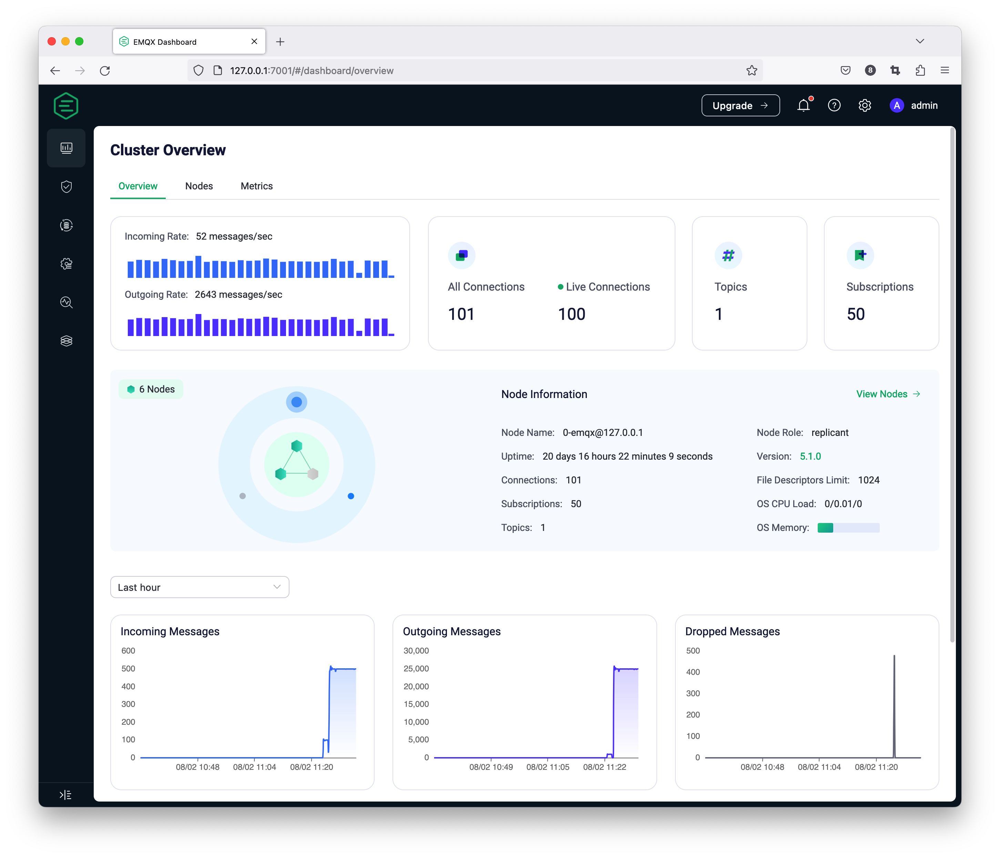

# EMQX 5.0 Dashboard


EMQX Dashboard is a comprehensive web interface for managing and monitoring EMQX. This intuitive tool allows users to effortlessly oversee EMQX clusters, customize features, and display data visually.



## 🎯 Key Features

- **Data Monitoring & Management**: Get a comprehensive overview of crucial data.
  
- **Visual Access Control Management**: Pre-configured authentication and authorization.
  
- **Robust Data Integration Capabilities**: Includes a flow editor and bi-directional data bridge.
  
- **Real-time Configuration Updates**: Hot updates with instant configuration saving.
  
- **Customizable Extension Capabilities**: Built-in gateways, plugins, and hooks.
  
- **Comprehensive Diagnostic Tools**: Enables timely problem identification and resolution.

## 🚀 Getting Started

First, ensure that the latest version of [EMQX](https://www.emqx.com/en/try?product=broker) is installed.

Post successful installation, access the EMQX Dashboard by opening <http://localhost:18083/> in your browser (replace `localhost` with the actual IP if not on local machine). By default, the EMQX Dashboard listens on port 18083.

> EMQX can operate without the Dashboard. The Dashboard provides a convenient visual interface for users.

## 🤝 Get Involved

- Stay updated with the latest news by following [@EMQTech on Twitter](https://twitter.com/EMQTech).
  
- Have a question? Check our [discussion forums](https://github.com/emqx/emqx/discussions).
  
- Join our [official Discord](https://discord.gg/xYGf3fQnES) for general discussions.
  
- Subscribe to our [EMQX YouTube](https://www.youtube.com/channel/UC5FjR77ErAxvZENEWzQaO5Q) channel for video resources.

## 📘 Useful Resources

- [MQTT client programming](https://www.emqx.com/en/blog/tag/mqtt-client-programming)

  Learn MQTT in PHP, Node.js, Python, Golang, and more with this collection of blog posts.

- [MQTT SDKs](https://www.emqx.com/en/mqtt-client-sdk)

  Browse popular MQTT client SDKs in various programming languages, complemented with code examples.

- [MQTTX](https://mqttx.app/)

  A versatile cross-platform MQTT 5.0 client tool offering desktop, command-line, and web interfaces.

- [Internet of Vehicles](https://www.emqx.com/en/blog/category/internet-of-vehicles)

  Build a reliable, efficient, and industry-specific IoV platform leveraging EMQ's practical experience.

## 💻 Local Development

To set up for local development, follow these steps:

1. Fork the repository and clone your fork:

    ```shell
    git clone https://github.com/your-username/emqx-dashboard5.git
    cd emqx-dashboard5
    ```

   Or, clone the original repository directly:

    ```shell
    git clone https://github.com/emqx/emqx-dashboard5.git
    cd emqx-dashboard5
    ```

2. Install the dependencies:

    ```shell
    pnpm install
    ```

3. To start the development server, run:

    ```shell
    pnpm dev
    ```

4. For production compilation and minification:

    ```shell
    pnpm build
    ```

5. Lint and fix files:

    ```shell
    pnpm lint
    ```

   Or, format the code with Prettier:

    ```shell
    pnpm format
    ```

## ☁️ Development with Cloud Host

To set up for development with a cloud host:

1. Create a new `.env.development.local` file:

    ```shell
    touch .env.development.local
    ```

2. Define your cloud host address in the `.env.development.local` file:

    ```shell
    HOST_URL=http://your-cloud-host:port/
    ```

3. Start the development server:

    ```shell
    pnpm serve
    ```

## ⚙️ Vue.js Customize Configuration

Refer to the [Configuring Vite](https://vitejs.dev/config/#configuring-vite) for more information.

After the completion of setup, the CI will run automatically and deploy upon successful execution.

## License

EMQX Dashboard is licensed under the
[Business Source License 1.1](./LICENSE) (`BUSL-1.1`). This is a source-available
license. Each Dashboard version transitions to Apache License, Version 2.0
four years after that version's first publicly available distribution under BSL.
The date is calculated separately for each version, including patch releases,
across all maintained release series. Republishing the same version does not
restart the four-year period.

Use the Dashboard release tag and its first public distribution records to
identify the version and its publication date, rather than relying solely on
`package.json`. The conversion date is independent of Broker versions and their
release dates; connecting to a different Broker does not change it. Conversion
of a Dashboard version does not change the license applicable to the Broker.

Both standard and enterprise builds include the complete `LICENSE` in `dist/`
and their release archives.

The Dashboard is used in conjunction with the EMQX broker. The Additional Use
Grant permits production use of the Dashboard to manage and monitor the broker
when the corresponding broker use is permitted under its applicable license,
including any applicable commercial agreement. This includes single-node use,
educational or non-profit use, and commercially licensed cluster or hosted use
to the extent permitted by the applicable broker license or agreement. No
separate Dashboard production license is required for uses covered by this grant.

This license follows the licensing model of the
[EMQX broker](https://github.com/emqx/emqx/blob/master/LICENSE), with the Licensed
Work and Additional Use Grant adapted for the Dashboard. The broker remains
subject to its own license; this license does not grant additional rights to use
the broker. See the [EMQX Licensing FAQ](https://www.emqx.com/en/content/license-faq)
for background on the broker's licensing model.

Third-party code and dependencies remain subject to their respective licenses.
