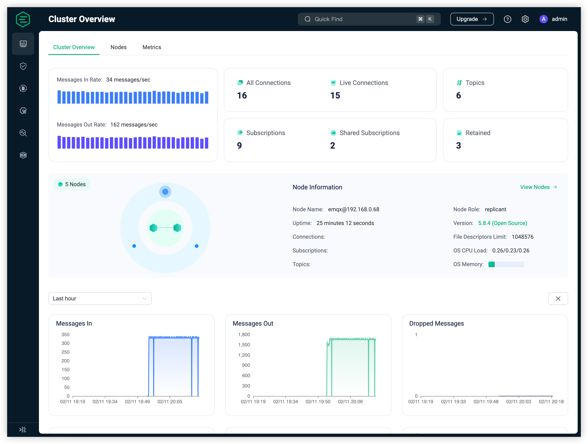

# EMQX 5.0 Dashboard


EMQX Dashboard is a comprehensive web interface for managing and monitoring EMQX. This intuitive tool allows users to effortlessly oversee EMQX clusters, customize features, and display data visually.



## 🎯 Key Features

- **Data Monitoring & Management**: Get a comprehensive overview of crucial data.
  
- **Visual Access Control Management**: Pre-configured authentication and authorization.
  
- **Robust Data Integration Capabilities**: Includes a flow editor and bi-directional data bridge.
  
- **Real-time Configuration Updates**: Hot updates with instant configuration saving.
  
- **Customizable Extension Capabilities**: Built-in gateways, plugins, and hooks.
  
- **Comprehensive Diagnostic Tools**: Enables timely problem identification and resolution.

## 🚀 Getting Started

First, ensure that the latest version of [EMQX](https://www.emqx.com/en/try?product=broker) is installed.

Post successful installation, access the EMQX Dashboard by opening <http://localhost:18083/> in your browser (replace `localhost` with the actual IP if not on local machine). By default, the EMQX Dashboard listens on port 18083.

> EMQX can operate without the Dashboard. The Dashboard provides a convenient visual interface for users.

## 🤝 Get Involved

- Stay updated with the latest news by following [@EMQTech on Twitter](https://twitter.com/EMQTech).
  
- Have a question? Check our [discussion forums](https://github.com/emqx/emqx/discussions).
  
- Join our [official Discord](https://discord.gg/xYGf3fQnES) for general discussions.
  
- Subscribe to our [EMQX YouTube](https://www.youtube.com/channel/UC5FjR77ErAxvZENEWzQaO5Q) channel for video resources.

## 📘 Useful Resources

- [MQTT client programming](https://www.emqx.com/en/blog/tag/mqtt-client-programming)

  Learn MQTT in PHP, Node.js, Python, Golang, and more with this collection of blog posts.

- [MQTT SDKs](https://www.emqx.com/en/mqtt-client-sdk)

  Browse popular MQTT client SDKs in various programming languages, complemented with code examples.

- [MQTTX](https://mqttx.app/)

  A versatile cross-platform MQTT 5.0 client tool offering desktop, command-line, and web interfaces.

- [Internet of Vehicles](https://www.emqx.com/en/blog/category/internet-of-vehicles)

  Build a reliable, efficient, and industry-specific IoV platform leveraging EMQ's practical experience.

## 💻 Local Development

To set up for local development, follow these steps:

1. Fork the repository and clone your fork:

    ```shell
    git clone https://github.com/your-username/emqx-dashboard5.git
    cd emqx-dashboard5
    ```

   Or, clone the original repository directly:

    ```shell
    git clone https://github.com/emqx/emqx-dashboard5.git
    cd emqx-dashboard5
    ```

2. Install the dependencies:

    ```shell
    pnpm install
    ```

3. To start the development server, run:

    ```shell
    pnpm dev
    ```

4. For production compilation and minification:

    ```shell
    pnpm build
    ```

5. Lint and fix files:

    ```shell
    pnpm lint
    ```

   Or, format the code with Prettier:

    ```shell
    pnpm format
    ```

## ☁️ Development with Cloud Host

To set up for development with a cloud host:

1. Create a new `.env.development.local` file:

    ```shell
    touch .env.development.local
    ```

2. Define your cloud host address in the `.env.development.local` file:

    ```shell
    HOST_URL=http://your-cloud-host:port/
    ```

3. Start the development server:

    ```shell
    pnpm serve
    ```

## ⚙️ Vue.js Customize Configuration

Refer to the [Configuring Vite](https://vitejs.dev/config/#configuring-vite) for more information.

After the completion of setup, the CI will run automatically and deploy upon successful execution.
